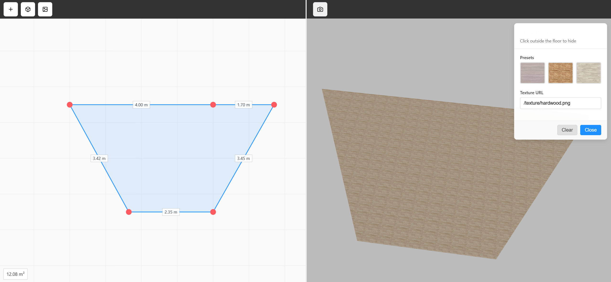

# Room Blueprint (2D + 3D)

Interactive room blueprint editor (2D) with real‑time 3D floor preview. Built with HTML Canvas and Three.js.

## Features

- **2D Blueprint (Canvas)**: add/move/insert/delete vertices, drag edges, snap/merge vertices, Shift‑drag to align X/Y.
- **Area Calculation**: live polygon area in m² shown on the 2D canvas.
- **3D Floor Preview (Three.js)**: generates a floor mesh from the 2D shape, with material/texture presets and texture URL input.
- **Resizable Split View**: drag the vertical splitter to adjust 2D/3D size ratio.
- **Export**: export 2D blueprint as PNG and 3D view as screenshot.

## Tech

- TypeScript, React, Vite
- HTML Canvas (2D editor)
- Three.js (3D preview)

## Run Locally

1. `cd room-blueprint`
2. `npm install`
3. `npm run dev`
4. Open the local URL printed by Vite